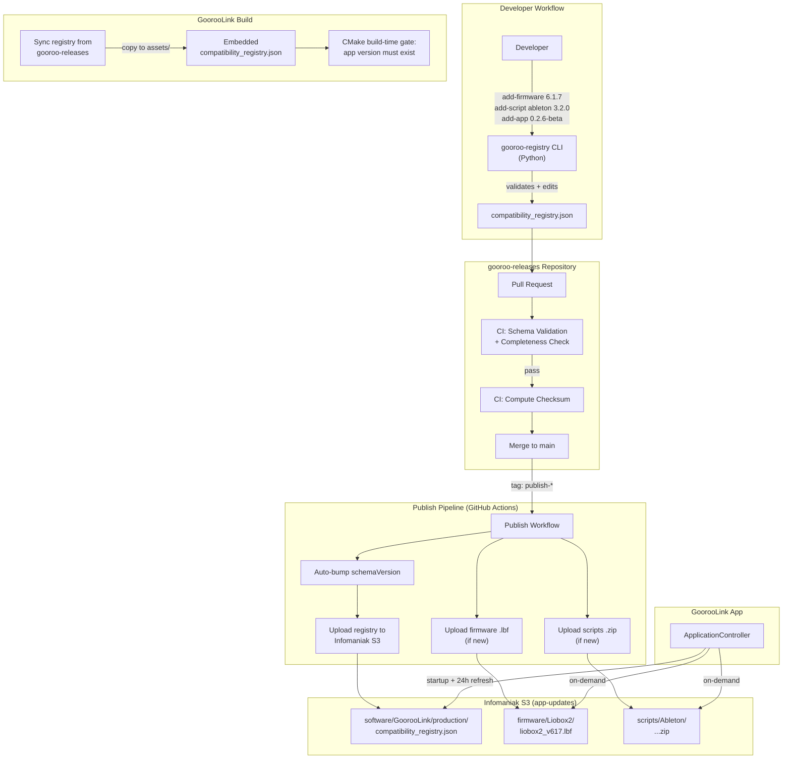
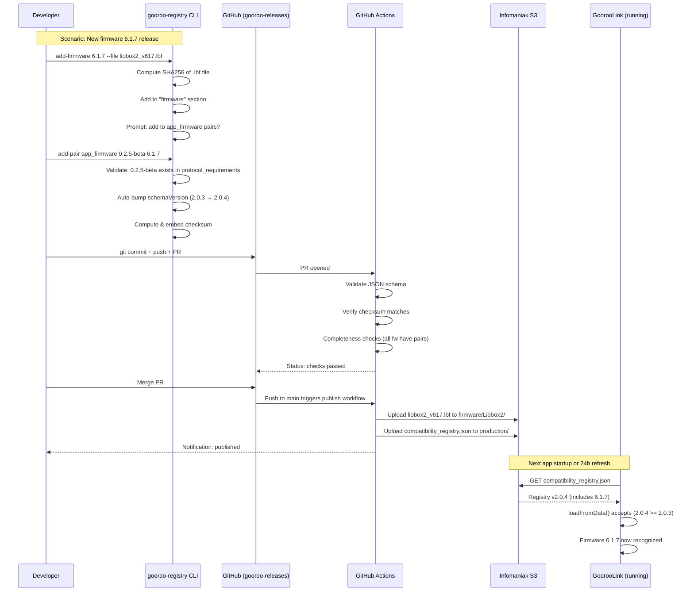

# Design: Compatibility Registry Release Pipeline

**Status**: ✅ Approved (Desktop-Driven CLI Workflow)
**Date**: 2026-03-24  
**Author**: Architecture Agent

---

## Context

The `compatibility_registry.json` is the single authority for cross-component version compatibility in the Gooroo ecosystem. It governs:

- **App ↔ Firmware** blocking gates (device won't connect if incompatible)
- **Firmware ↔ Ableton Script** informational warnings
- **Firmware ↔ Reaper Script** informational warnings
- **Protocol requirements** per app version
- **Download metadata** for firmware `.lbf` files and DAW scripts `.zip`

### The Problem

Today, the registry is managed **manually inside the GoorooLink repo**:

1. **Hand-editing JSON** — A developer opens `compatibility_registry.json`, manually adds entries, and must remember the exact structure. Easy to fat-finger a checksum, forget a pair, or omit a new firmware from an axis.

2. **No completeness enforcement** — The CMake build-time gate only checks that the current app version exists in `app_firmware` pairs. It does NOT catch:
   - New firmware versions missing from download metadata
   - New firmware versions not paired with any app version
   - New scripts missing from `available_scripts`
   - Script versions not paired with any firmware version

3. **No automated cloud publishing** — The `deploy.sh` uploads the app bundle and appcast.xml to Infomaniak S3, but the registry itself is only uploaded to the cloud manually (or not at all). Existing app installs that depend on cloud registry updates may not see new firmware/script compatibility until someone remembers to upload.

4. **Scattered artifact uploads** — Firmware `.lbf` and script `.zip` files are uploaded to S3 independently of the registry. There's no guarantee that a download URL in the registry actually points to a file that exists in the bucket.

5. **No review process** — Registry changes are committed directly alongside app code changes. There's no dedicated review step that asks "is this registry change correct and complete?"

### Goal

Create an **independent project** that:
- Is the **single source of truth** for the compatibility registry
- Makes it **impossible to forget** registry updates when releasing any component
- **Automatically publishes** the registry and artifacts to Infomaniak S3
- **Validates completeness** before any publish
- **Scales** as more devices, firmware versions, DAW integrations, and app versions are added

---

## Constraints

- **Cloud infrastructure is Infomaniak S3** — Object Storage accessed via Swift CLI or S3-compatible API. Bucket: `app-updates`. Credentials are OpenStack-based.
- **Registry format is fixed** — The JSON schema is consumed by the GoorooLink C++ `CompatibilityRegistry` class and must not change structurally without app-side changes.
- **Checksum is mandatory** — Every published registry must have a valid `sha256:` checksum computed over sorted-keys compact JSON (matching the C++ and Python implementations).
- **schemaVersion must be semver-monotonic** — The app rejects registries with a `schemaVersion` lower than the currently loaded one. Every publish must bump the version.
- **Signing not required** — The registry is fetched via `signer.php` (secret-header authenticated). No additional signing of the JSON itself is needed beyond the integrity checksum.
- **GoorooLink app is not modified** — This project is external. The app continues to load the embedded registry at build time and fetch from the cloud at runtime. The only touch point is syncing the registry file into the GoorooLink repo for embedding.
- **Single developer today, multi-contributor future** — The solution should work for one person but not break when the team grows.

---

## Approaches Considered

### Option A — CI/CD Pipeline (GitHub Actions)

CI/CD with PR-based review and automated publishing.

**Disadvantages for single developer:**
- PR cycle adds latency
- GitHub Actions secrets management overhead
- Extra infrastructure to maintain

**Verdict**: Unnecessary for solo developer. Defer if team scales.

### Option B — Desktop CLI-Only (Recommended)

A Python CLI tool (`gooroo-registry`) that runs **entirely on the developer's machine**. All validation (schema, completeness, checksum) happens before publish. The CLI directly uploads to Infomaniak S3.

**Advantages:**
- Fast iteration — edit, validate, publish all locally
- Simple setup — no GitHub Actions secrets, no CI infrastructure
- Full freedom — developer owns the workflow
- Git is still the audit trail (commits track who changed what and when)
- Separates release management into a dedicated repo (not mixed with app code)

**Trade-offs:**
- No enforcing pre-publish gate (developer must remember to validate + commit)
- Requires Infomaniak credentials on local machine
- Sole responsibility on the developer — mistakes aren't caught by a pipeline
- **Mitigation**: All validators are in the CLI; running `gooroo-registry validate` is trivial and catches 99% of issues before publish

**Verdict**: Perfect for single developer. Fast, simple, and sufficient.

### Option C — Web Dashboard

**Verdict**: Overkill for current scale. Rejected.

---

## Recommended Solution: Option B — Desktop-Driven CLI in Dedicated Repository

### Why Option B

You're a single developer today, and speed matters more than automated gates. The CLI's validators are your safety net — they run instantly and catch mistakes before any S3 upload. Git is the audit trail.

When the team scales, you can add PR-based review or CI/CD without redesigning the CLI — the tool will already be battle-tested.

---

## Architecture Overview



---

## Repository Structure

```
gooroo-releases/
├── README.md                           # Workflow documentation + credential setup
├── pyproject.toml                      # Python project config (gooroo-registry CLI)
├── registry/
│   └── compatibility_registry.json     # THE canonical source of truth
├── artifacts/
│   ├── firmware/                       # Firmware metadata ONLY (binaries NOT in Git)
│   │   ├── liobox2_v616.json           # Metadata: version, S3 path, checksum
│   │   └── liobox2_v617.json
│   ├── scripts/
│   │   ├── ableton/
│   │   │   ├── v3.1.5.json
│   │   │   └── v3.1.6.json
│   │   └── reaper/
│   │       └── v1.1.0.json
│   └── appcast_template.xml            # Template for Sparkle appcast generation
├── src/
│   └── gooroo_registry/
│       ├── __init__.py
│       ├── cli.py                      # Click-based CLI entry point
│       ├── registry.py                 # Registry model (load, validate, edit, save)
│       ├── checksum.py                 # Checksum computation
│       ├── validators.py               # Completeness and integrity validators
│       ├── publisher.py                # S3 upload + appcast update logic
│       ├── sparkle_generator.py        # Sparkle appcast XML generation
│       └── schema.py                   # JSON schema definition
├── tests/
│   ├── test_registry.py
│   ├── test_validators.py
│   ├── test_checksum.py
│   ├── test_sparkle_generator.py
│   └── fixtures/
│       └── valid_registry.json
├── config/
│   └── openstack_env.sh                # Template for OpenStack credentials (DO NOT COMMIT ACTUAL CREDENTIALS)
└── .gitignore                          # Excludes credentials, pycache, .venv, *.lbf, *.zip
```

**Note:** No `.github/workflows/` — all validation and publishing happens locally via the CLI. Actual firmware `.lbf` and script `.zip` files are **not** stored in Git; only their metadata is tracked.

---

## Component Details

### 1. CLI Tool (`gooroo-registry`)

A Python CLI (Click or Typer) installed via `pip install -e .` that provides these commands:

#### Commands

| Command | Description | Example |
|---|---|---|
| `add-firmware` | Add a firmware version with .lbf file | `gooroo-registry add-firmware 6.1.7 --file path/to/liobox2_v617.lbf` |
| `add-app` | Add app version with protocol requirements | `gooroo-registry add-app 0.2.6-beta --gprot 3.0.0 --datamodel 1.0.0 --std-cmd 1.0.0 --dev-cmd 2.0.0` |
| `add-script` | Add a DAW script version with .zip file | `gooroo-registry add-script ableton 3.2.0 --file path/to/scripts.zip` |
| `add-pair` | Add a compatibility pair to an axis | `gooroo-registry add-pair app_firmware 0.2.6-beta 6.1.7` |
| `remove-pair` | Remove a compatibility pair | `gooroo-registry remove-pair app_firmware 0.2.3-beta 6.1.3` |
| `validate` | Run all validators without modifying | `gooroo-registry validate` |
| `publish` | Publish to S3 (for local use; CI uses the workflow) | `gooroo-registry publish --dry-run` |
| `sync` | Copy registry to GoorooLink repo for embedding | `gooroo-registry sync --target ~/Dev/GoorooLink/GoorooLinkContent/assets/` |
| `status` | Show summary of current registry state | `gooroo-registry status` |
| `diff` | Show diff between local and cloud registry | `gooroo-registry diff` |

#### Behavior of `add-firmware`

```
$ gooroo-registry add-firmware 6.1.7 --file ./liobox2_v617.lbf

✓ Computing SHA256 of liobox2_v617.lbf...
  sha256:a1b2c3d4e5f6...

✓ Adding firmware entry:
  version: 6.1.7
  path: /firmware/Liobox2/liobox2_v617.lbf
  checksum: sha256:a1b2c3d4e5f6...

✓ Copying liobox2_v617.lbf → artifacts/firmware/liobox2_v617.lbf

⚠ Warning: Firmware 6.1.7 is not paired with any app version in app_firmware.
  Run: gooroo-registry add-pair app_firmware <app_version> 6.1.7

✓ Auto-bumped schemaVersion: 2.0.3 → 2.0.4
✓ Checksum updated.
✓ Registry saved.
```

Key: the CLI **warns about missing pairs** immediately, so you can't forget.

#### Behavior of `validate`

```
$ gooroo-registry validate

Checking schema structure.............. ✓
Checking checksum integrity............ ✓
Checking version monotonicity.......... ✓

Checking completeness:
  ✓ All firmware versions have at least one app_firmware pair
  ✓ All app versions in app_firmware have protocol_requirements entries
  ✓ All firmware versions in firmware_ableton_script pairs exist in firmware section
  ✗ Firmware 6.1.7 has no firmware_ableton_script pair
  ✗ Firmware 6.1.7 has no firmware_reaper_script pair
  ✓ All script versions in available_scripts have at least one pair
  ✓ All download paths reference files that exist in artifacts/

2 warnings, 0 errors.
```

### 2. Local Validators

Before publishing, run validators locally to catch mistakes:

```bash
$ gooroo-registry validate

Checking schema structure.............. ✓
Checking checksum integrity............ ✓
Checking version monotonicity.......... ✓

Checking completeness:
  ✓ All firmware versions have at least one app_firmware pair
  ✓ All app versions in app_firmware have protocol_requirements entries
  ✓ All firmware versions in firmware_ableton_script pairs exist in firmware section
  ✗ Firmware 6.1.7 has no firmware_ableton_script pair
  ✗ Firmware 6.1.7 has no firmware_reaper_script pair
  ✓ All script versions in available_scripts have at least one pair
  ✓ All download paths reference files that exist in artifacts/

2 warnings.

# Fix issues or force publish (not recommended):
$ gooroo-registry publish --strict
❌ Publish refused: 2 warnings must be resolved.
```

**Validators enforce:**

| Rule | Severity | Description |
|---|---|---|
| **Schema conformance** | Error | Required fields exist, types are correct |
| **Checksum integrity** | Error | Stored checksum matches computed checksum |
| **Version format** | Error | All versions are valid semver strings |
| **No orphan firmware** | Warning | Every firmware version appears in at least one `app_firmware` pair |
| **No orphan app version** | Warning | Every app version in `app_firmware` has `protocol_requirements` |
| **No orphan scripts** | Warning | Every script in `available_scripts` appears in at least one pair on its axis |
| **Download path exists** | Error | Every `path` in firmware/scripts references a file in `artifacts/` |
| **No duplicate versions** | Error | No version appears twice in any section |

When you run `publish --strict`, warnings become errors — nothing incomplete reaches S3. **Running `validate --strict` before every publish is mandatory.**

### 3. Local Publish to S3

Once validated, publish directly from your machine:

```bash
$ gooroo-registry publish --strict

Validating registry (strict mode).............. ✓
Verifying artifact files exist................ ✓
Computing checksums........................... ✓

Diff with remote:
  New: firmware/Liobox2/liobox2_v617.lbf
  New: scripts/Ableton/Liobox2_AbletonScripts_3.2.0.zip
  Changed: registry schemaVersion 2.0.3 → 2.0.4

Uploading firmware/Liobox2/liobox2_v617.lbf (512 KB)....... ✓
Uploading scripts/Ableton/Liobox2_AbletonScripts_3.2.0.zip (256 KB)....... ✓
Uploading software/GoorooLink/production/compatibility_registry.json (45 KB)....... ✓
Verifying checksums on remote........... ✓

✓ Publish complete!.
```

**Setup required:**
- Infomaniak OpenStack credentials stored as environment variables or in `config/openstack_env.sh`
- `python-swiftclient` and `python-keystoneclient` installed (`pip install -e .` handles this)

**Upload order matters**: Artifacts (firmware, scripts) are uploaded **before** the registry. This prevents the registry from referencing downloads that don't exist yet.

### 4. Sync Registry to GoorooLink for Embedding

When adding a new app version, embed the updated registry in the GoorooLink repo:

```bash
$ gooroo-registry sync --target ~/Dev/GoorooLink/GoorooLinkContent/assets/

✓ Copied registry/compatibility_registry.json
  → ~/Dev/GoorooLink/GoorooLinkContent/assets/compatibility_registry.json
```

The embedded registry is a **baseline**. The cloud always has the latest version. Update the embedded copy when:
- A new app version is added (required by CMake build-time gate)
- Protocol requirements change for the new app version

---

## Local Workflow Summary

1. **Edit** → Use CLI commands (`add-firmware`, `add-pair`, etc.)
2. **Validate** → `gooroo-registry validate --strict` catches errors
3. **Publish** → `gooroo-registry publish --strict` uploads to S3
4. **Commit** → `git add + git commit` creates audit trail
5. **Sync** (if app version added) → `gooroo-registry sync --target ~/Dev/GoorooLink/...`
6. **Build GoorooLink** → CMake gate ensures app version exists in registry

**No GitHub Actions. No PRs. No CI delays. Developer is responsible for running validators.**

---

## Release Scenario Flows

### Scenario 1: New Firmware Release

```
1. Developer builds firmware 6.1.7, produces liobox2_v617.lbf
2. $ gooroo-registry add-firmware 6.1.7 --file ./liobox2_v617.lbf
3. $ gooroo-registry add-pair app_firmware 0.2.5-beta 6.1.7
4. $ gooroo-registry add-pair firmware_ableton_script 6.1.7 3.1.6
5. $ gooroo-registry add-pair firmware_reaper_script 6.1.7 1.1.0
6. $ gooroo-registry validate --strict   # must pass
7. $ gooroo-registry publish --strict    # uploads to S3
8. $ git commit -am "Add firmware 6.1.7" && git push
9. Running GoorooLink apps pick up new registry within 24h
```

### Scenario 2: New App Version Release

```
1. Developer prepares GoorooLink 0.2.6-beta
2. $ gooroo-registry add-app 0.2.6-beta --gprot 3.0.0 --datamodel 1.0.0 --std-cmd 1.0.0 --dev-cmd 2.0.0
3. $ gooroo-registry add-pair app_firmware 0.2.6-beta 6.1.6
4. $ gooroo-registry add-pair app_firmware 0.2.6-beta 6.1.5
5. $ gooroo-registry validate --strict && gooroo-registry publish --strict
6. $ git commit -am "Add app version 0.2.6-beta" && git push
7. $ gooroo-registry sync --target ~/Dev/GoorooLink/GoorooLinkContent/assets/
8. In GoorooLink repo: commit updated registry, build app
9. CMake gate passes (0.2.6-beta exists in pairs)
10. deploy.sh builds, signs, notarizes, uploads app
```

### Scenario 3: New Ableton Script Release

```
1. Developer produces Liobox2_AbletonScripts_3.2.0.zip
2. $ gooroo-registry add-script ableton 3.2.0 --file ./scripts.zip
3. $ gooroo-registry add-pair firmware_ableton_script 6.1.6 3.2.0
4. $ gooroo-registry add-pair firmware_ableton_script 6.1.7 3.2.0
5. $ gooroo-registry validate --strict && gooroo-registry publish --strict
6. $ git commit -am "Add Ableton script 3.2.0" && git push
7. Running apps see new script version available for download
```

### Scenario 4: Hotfix (Urgent Registry Update)

```
1. $ gooroo-registry add-pair app_firmware 0.2.5-beta 6.1.7
2. $ git commit + push directly to main (or fast-track PR)
3. GitHub Actions publishes immediately
4. OR: $ gooroo-registry publish   # manual publish from local machine
```

The `workflow_dispatch` trigger allows manual publishing without waiting for a PR cycle.

---

## Release Sequence Diagram



---

## Scaling Considerations

| Dimension | How the design handles it |
|---|---|
| **More firmware versions** | Each is an `add-firmware` + `add-pair` — CLI enforces completeness |
| **More DAWs** | Add a new axis (e.g., `firmware_logic_script`). CLI and validators are axis-agnostic — they iterate all axes dynamically |
| **More devices** (Liobox3, etc.) | Registry can be extended with device-specific axis naming (e.g., `app_firmware_liobox3`). The CLI tool is parametric. |
| **Multiple contributors** | PR review + branch protection + CI validation = safe concurrent editing |
| **Release cadence increase** | GitHub Actions runs on every merge — no manual steps. `schemaVersion` auto-increments. |
| **Rollback** | `git revert` + merge → publishes the reverted registry. Cloud apps pick it up within 24h. |

---

## Migration Plan

### Phase 1: Repository Setup
1. Create `gooroo-releases` GitHub repository
2. Copy current `compatibility_registry.json` as the initial state
3. Set up Git LFS for `artifacts/` directory
4. Copy existing firmware/script files into `artifacts/`
5. Create `config/openstack_env.sh` template (do NOT commit credentials)

### Phase 2: CLI Tool
1. Implement `gooroo_registry` Python package with core commands
2. Port `compute_registry_checksum.py` logic into `checksum.py`
3. Write validators (all run locally before publish)
4. Write publisher (direct S3 upload via `python-swiftclient`)
5. Write tests

### Phase 3: Final Integration
1. Add `sync` command for copying registry to GoorooLink
2. Document the new release workflow in README with credential setup
3. Remove manual registry editing from GoorooLink development process
4. Verify first publish to production works end-to-end

### Phase 4: Future Enhancements (Optional)
1. Slack/Discord notifications on successful publish
2. Registry diff dashboard or simple CLI comparison
3. Support for multiple device types (Liobox3, etc.)
4. (When team scales) Add PR-based review workflow via GitHub Actions

---

## Key Interfaces

### CLI entry point

```python
# src/gooroo_registry/cli.py

@click.group()
@click.option('--registry', default='registry/compatibility_registry.json')
@click.pass_context
def cli(ctx, registry):
    """Gooroo Releases — Compatibility Registry Manager"""
    ctx.ensure_object(dict)
    ctx.obj['registry_path'] = registry


@cli.command()
@click.argument('version')
@click.option('--file', required=True, type=click.Path(exists=True))
def add_firmware(version, file):
    """Add a firmware version with its .lbf binary."""
    ...

@cli.command()
@click.argument('version')
@click.option('--gprot', required=True)
@click.option('--datamodel', required=True)
@click.option('--std-cmd', required=True)
@click.option('--dev-cmd', required=True)
def add_app(version, gprot, datamodel, std_cmd, dev_cmd):
    """Add an app version with its protocol requirements."""
    ...

@cli.command()
@click.argument('axis')
@click.argument('left_version')
@click.argument('right_version')
def add_pair(axis, left_version, right_version):
    """Add a compatibility pair to an axis."""
    ...

@cli.command()
@click.option('--strict', is_flag=True)
@click.option('--publish-mode', is_flag=True)
def validate(strict, publish_mode):
    """Run all validators against the current registry."""
    ...

@cli.command()
@click.option('--dry-run', is_flag=True)
def publish(dry_run):
    """Publish registry and new artifacts to Infomaniak S3."""
    ...

@cli.command()
@click.option('--target', required=True, type=click.Path())
def sync(target):
    """Copy registry to GoorooLink assets for embedding."""
    ...
```

### Registry model

```python
# src/gooroo_registry/registry.py

class CompatibilityRegistryManager:
    """Load, validate, edit, and save the compatibility registry."""

    def __init__(self, path: Path):
        self.path = path
        self.data: dict = {}

    def load(self) -> None: ...
    def save(self) -> None: ...

    def add_firmware(self, version: str, path: str, checksum: str) -> None: ...
    def add_app_version(self, version: str, proto_reqs: dict) -> None: ...
    def add_script(self, axis: str, version: str, path: str, checksum: str) -> None: ...
    def add_pair(self, axis: str, left: str, right: str) -> None: ...
    def remove_pair(self, axis: str, left: str, right: str) -> None: ...

    def bump_schema_version(self) -> str: ...
    def update_checksum(self) -> str: ...
    def update_generated_at(self) -> None: ...
```

### Publisher

```python
# src/gooroo_registry/publisher.py

class S3Publisher:
    """Upload artifacts and registry to Infomaniak S3 via Swift."""

    CONTAINER = "app-updates"
    REGISTRY_OBJECT = "software/GoorooLink/production/compatibility_registry.json"

    def __init__(self, dry_run: bool = False): ...

    def diff_with_remote(self) -> list[str]:
        """Return list of artifacts that differ from remote."""
        ...

    def upload_artifact(self, local_path: Path, remote_path: str) -> None: ...
    def upload_registry(self, registry_path: Path) -> None: ...
    def verify_upload(self, remote_path: str, expected_checksum: str) -> bool: ...

    def publish_all(self, registry: CompatibilityRegistryManager) -> None:
        """Upload new artifacts first, then the registry."""
        ...
```

---

## Security Considerations

- **Local credential management** — Infomaniak OpenStack credentials stored in `config/openstack_env.sh` (never committed to Git). Load credentials from environment or keychain at publish time.
- **No plaintext credentials in repo** — `.gitignore` excludes `config/openstack_env.sh` and any `.env` files
- **Checksum verification after upload** — ensures integrity on S3
- **Artifact upload order** (artifacts before registry) — prevents dangling references
- **Git audit trail** — every publish is tied to a commit message and developer identity (`git commit`)
- **Git LFS for binary artifacts** — keeps the repo manageable and tracked via Git
- **Single developer responsibility** — Because credentials are local to one machine, access control is implicit. When team scales, credentials should be rotated and managed via shared system (e.g., Vault, 1Password).

---

## Open Questions

1. **Git LFS vs. reference-only for artifacts?** — Storing firmware `.lbf` (≈100KB–1MB each) and script `.zip` (≈50KB each) in Git LFS is manageable. Alternative: store only metadata in Git and upload artifacts manually to S3 before the registry publish. LFS is simpler and provides full audit trail.

2. **Should the publish workflow also update the Sparkle appcast.xml?** — Currently `deploy.sh` handles this. It could be unified, but mixing app deployment with registry management adds complexity. Recommendation: keep them separate for now — `deploy.sh` for app bundles, `gooroo-releases` for everything else.

3. **Auto-PR to GoorooLink?** — A GitHub Action in `gooroo-releases` could open a PR in GoorooLink with the updated registry. This ensures the embedded copy is always current. Worth doing in Phase 5 but not blocking.

4. **How to handle pre-release testing?** — A `staging` branch could publish to a staging S3 path (e.g., `software/GoorooLink/staging/compatibility_registry.json`). Debug builds of GoorooLink could fetch from staging. Not needed immediately.

5. **Notification mechanism?** — Slack webhook, email, or GitHub notification on successful publish? Low priority but useful for team awareness.

---

## What Stays the Same in GoorooLink

- `CompatibilityRegistry` C++ class: unchanged
- `loadFromResource()` / `loadFromData()`: unchanged
- Cloud fetch via `SignedUrlResolver`: unchanged
- CMake build-time gate: unchanged (still validates app version exists)
- `compute_registry_checksum.py`: still used by CMake pre-build step for the embedded copy
- `deploy.sh`: still handles app bundle build/sign/notarize/upload

---

## Delegation

Recommended agent(s) to implement this design:
- **Python Developer** — Build the `gooroo-registry` CLI tool, validators, publisher, and tests. Set up the GitHub repository with Git LFS.

> Implementation should be delegated to a **Python Developer**: the entire project is a Python CLI tool with no C++/QML changes needed. The new repository is minimal — just `src/`, `registry/`, `artifacts/`, tests, and a README.
